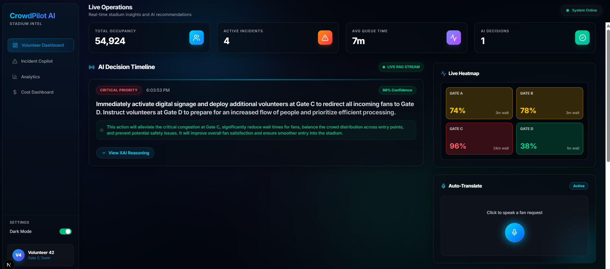

# CrowdPilot AI - Smart Stadium Operations

CrowdPilot AI is an advanced, Explainable AI (XAI) decision support platform designed specifically for FIFA World Cup 2026 stadium volunteers. It solves complex crowd management and multilingual assistance challenges by providing real-time, explainable recommendations based on live telemetry and historical RAG data.

---

## 🛑 The Problem

Managing a global event like the FIFA World Cup involves highly dynamic, unpredictable crowds and extreme language barriers. Volunteers are often overwhelmed by sudden bottlenecks and lack the operational visibility or language skills to redirect fans efficiently. Without real-time, explainable guidance, minor incidents can escalate into critical safety hazards.

---

## 🏗️ Architecture

CrowdPilot AI utilizes a Clean Architecture pattern, decoupling the AI orchestration layer from the frontend presentation layer.
- **Frontend**: Next.js React client with TailwindCSS and Framer Motion for a fluid, real-time operations dashboard.
- **Backend**: FastAPI REST server acting as the telemetry single-source-of-truth.
- **AI Brain**: Google Cloud Vertex AI (Gemini 2.5 Flash) orchestrating decisions, predicting bottlenecks, and translating audio.
- **State Management**: Live telemetry polling updates the global stadium state, recalculating Cost Savings and Heatmaps dynamically based on crowd flow.

---

## ✨ Features

- **Explainable AI (XAI) Decision Engine**: Generates continuous routing recommendations. Every decision includes the Observation, Reasoning, Prediction, Action, and Expected Impact. 
- **AI Incident Copilot**: Upload raw incident reports (CSV) and the AI automatically assigns priorities, reasoning, and public announcement scripts.
- **Multilingual Assistant**: A browser-native Speech-to-Text module that allows volunteers to speak foreign languages and automatically transcribe and translate them.
- **Live Spatial Heatmap**: Real-time visualization of gate occupancy.
- **Dynamic Cost Dashboard**: Calculates estimated USD savings and volunteer overtime prevented based on live crowd redirection metrics.
- **AI Activity Log**: A live, scrolling terminal tracking every Vertex AI interaction, including latency and confidence scores.

---

## 🧠 AI Workflow

1. **Ingestion**: Raw telemetry data (`crowd_data.csv`) and incident reports (`incidents.csv`) are uploaded to the FastAPI backend.
2. **State Processing**: The Data Processing Service sanitizes the input and updates the global `StadiumState`.
3. **Vertex AI Inference**: The telemetry state is injected into a highly engineered prompt and sent to Gemini 2.5 Flash.
4. **Structured Output**: The model returns a strict JSON schema containing the AI's reasoning, confidence, and action plan.
5. **UI Rendering**: The frontend polls the backend and renders the XAI flow in a beautiful, human-readable timeline.

---

## 📁 Folder Structure

```
CrowdPilotAI/
├── backend/
│   ├── app/
│   │   ├── api/           # REST API endpoints (copilot, telemetry)
│   │   ├── models/        # Pydantic schemas (AILogEntry, StadiumState)
│   │   ├── services/      # Core logic (AIService, TelemetryService)
│   │   └── main.py        # FastAPI entry point
│   ├── tests/             # Pytest backend test suite
│   ├── Dockerfile         # Backend containerization
│   └── requirements.txt
├── frontend/
│   ├── src/
│   │   ├── app/           # Next.js App Router (page.tsx, analytics, etc)
│   │   ├── components/    # Reusable React components (Sidebar, CsvUploader)
│   │   └── globals.css    # Tailwind & Glassmorphism styles
│   └── Dockerfile         # Frontend containerization
├── crowd_data.csv         # Demo dataset for live telemetry
└── incidents.csv          # Demo dataset for Incident Copilot
```

---

## 🛠️ Tech Stack

- **Frontend**: Next.js 15, React 19, TailwindCSS, Framer Motion, Lucide Icons
- **Backend**: Python 3.11, FastAPI, Uvicorn, Pandas, Pydantic
- **AI / ML**: Google Cloud Vertex AI (Gemini 2.5 Flash), Google Cloud ADC
- **Testing**: Pytest (Backend), Jest (Frontend)
- **Deployment**: Docker, Google Cloud Run

---

## ⚙️ Setup

### 1. Google Cloud Authentication (Vertex AI)

Instead of using a standard API key, this project authenticates locally using Google Cloud Application Default Credentials (ADC).

1. Install the [Google Cloud CLI](https://cloud.google.com/sdk/docs/install).
2. Run the following command in your terminal to authenticate:
   ```bash
   gcloud auth application-default login
   ```
3. Set up the `.env` file in the backend directory:
   ```bash
   cp backend/.env.example backend/.env
   ```
4. Edit `backend/.env` and add your GCP Project ID:
   ```env
   GCP_PROJECT_ID="your-google-cloud-project-id"
   GCP_LOCATION="us-central1"
   ```

---

## 🚀 How to Run

### Backend (FastAPI)
```bash
cd backend
python -m venv venv
.\venv\Scripts\activate  # Windows
# source venv/bin/activate # Mac/Linux
pip install -r requirements.txt
uvicorn app.main:app --reload
```
API available at `http://localhost:8000`.

### Frontend (Next.js)
```bash
cd frontend
npm install
npm run dev
```
App available at `http://localhost:3000`.

---

## ☁️ Google Cloud Run Deployment

To deploy this project to Google Cloud Run, ensure you have the `gcloud` CLI installed and authenticated.

### 1. Deploy the Backend
Deploy the FastAPI backend first to get your API URL.
```bash
cd backend
gcloud run deploy crowdpilot-backend \
  --source . \
  --region us-central1 \
  --allow-unauthenticated \
  --set-env-vars GCP_PROJECT_ID="your-google-cloud-project-id" \
  --set-env-vars GCP_LOCATION="us-central1"
```
*Note the Service URL provided upon successful deployment (e.g., `https://crowdpilot-backend-xxxxx-uc.a.run.app`).*

### 2. Deploy the Frontend
Deploy the Next.js frontend, injecting the backend URL you just received.
```bash
cd ../frontend
gcloud run deploy crowdpilot-frontend \
  --source . \
  --region us-central1 \
  --allow-unauthenticated \
  --set-env-vars NEXT_PUBLIC_API_URL="https://crowdpilot-backend-xxxxx-uc.a.run.app" 
```

---

## 📸 Screenshot



---

## 🔮 Future Scope

- **Real Hardware Integration**: Replace CSV uploads with direct WebSockets connecting to physical turnstiles and CCTV computer vision APIs.
- **RAG Expansion**: Integrate a massive Vector Database (Pinecone/Weaviate) containing decades of historical stadium crowd data to improve Vertex AI's prediction accuracy.
- **Mobile Volunteer App**: Port the React application to React Native for a dedicated iOS/Android app for field volunteers.
- **Multi-Agent Orchestration**: Deploy separate Vertex AI agents (e.g., Medical Agent, Security Agent) that communicate and negotiate response priorities.
